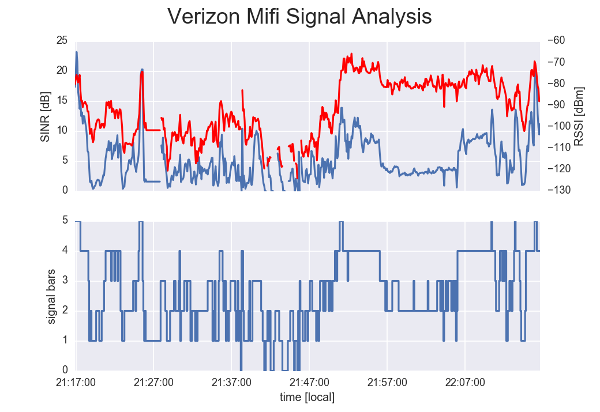

===========================
Mifi RSSI reader and logger
===========================

Example of using ``dryscrape`` to get jQuery updated webpage and Beautiful Soup to parse the HTML. 
Could be readily adapted for fantasy sports teams, political polling live results, and the like.

Tested with Franklin Wireless MHS800L a.k.a. Verizon Wireless Ellipsis MiFi.
Logs:

* RSSI
* SINR
* Signal Bars
* Connected/Not Connected

into a CSV file. if a value is not present (for example RSSI when not connected) that value is blank (commas adjacent to each other in this case).

Install
=======
::

    apt install xvfb

	python setup.py develop

Example Plot
============
::
	
	python mifiRSSI.py -p test/mifirssi.csv
